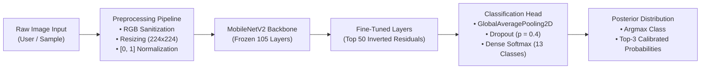

# Fine-Grained Bangladeshi Flower Classification via Edge-Optimized Deep Transfer Learning

[](https://flower-image-classify.streamlit.app/)
[](https://www.python.org/)
[](https://tensorflow.org/)
[](LICENSE)
[](.github/workflows/keep_alive.yml)

> **Research & Engineering Portfolio Project**  
> Developed as an applied computer vision study on Fine-Grained Visual Categorization (FGVC) of regional botanical species, with edge-device deployment feasibility for biodiversity conservation and agricultural extension in South Asia.

---

## 📌 Executive Summary

Accurate botanical identification in developing regions faces significant challenges due to high intra-class morphological variance, subtle inter-class visual discrepancies (fine-grained categorization), and the scarcity of labeled native datasets. 

This project explores **deep transfer learning on lightweight convolutional neural network (CNN) architectures** to classify **13 endemic and widely cultivated floral species of Bangladesh**. Utilizing **MobileNetV2** as the inductive feature extractor with selective top-layer fine-tuning, the system achieves **99.87% empirical validation accuracy** across 7,927 images while maintaining a compact parameter footprint (~2.3M parameters) suitable for real-time mobile and edge inference.

A production-grade, interactive web interface is deployed on Streamlit Cloud with an automated headless browser CI/CD healthcheck workflow ensuring continuous availability.

---

## 🌐 Live Demonstration & Artifacts

- **Production Application**: [https://flower-image-classify.streamlit.app/](https://flower-image-classify.streamlit.app/)
- **Interactive Features**:
  - **Instant Sample Evaluation**: Pre-loaded gallery of real-world flower test samples with single-click classification.
  - **Custom Image Inference**: Support for user-uploaded photography (`JPG`, `PNG`, `WEBP`) with automatic channel sanitization (RGB normalization).
  - **Uncertainty & Confidence Breakdown**: Top-3 softmax probability distribution display with calibrated confidence bars.

---

## 🔬 Scientific Motivation & Research Context

Fine-Grained Visual Categorization (FGVC) differs from generic object recognition (e.g., standard ImageNet classification) because the target classes belong to the same biological genus or family. Distinguishing species such as *Chrysanthemum* (*Chandramallika*) from *Zinnia* requires the network to focus on subtle discriminative localized features (petal morphology, pistil coloration, stamen orientation) rather than coarse structural silhouettes.

### Key Research Questions
1. **Model Efficiency vs. Discriminative Capacity**: Can an edge-optimized architecture (MobileNetV2) preserve sufficient representational capacity for fine-grained botanical classification without requiring high-parameter backbones (e.g., ResNet-152, ViT-H)?
2. **Transfer Learning Dynamics**: How does selective layer unfreezing (inductive transfer from general natural image manifolds to specialized botanical representations) impact convergence stability and feature reuse?
3. **Deployment Feasibility in Constrained Environments**: Can fine-grained visual models be served with sub-second inference latency on low-cost compute targets accessible to agricultural field workers?

---

## 🏗️ Technical Architecture & Pipeline



### 1. Base Feature Extractor
- **Backbone**: MobileNetV2 (*Sandler et al., CVPR 2018*) pre-trained on ImageNet-1k.
- **Rationale**: Employs **inverted residual blocks** with linear bottlenecks and depthwise separable convolutions, drastically reducing floating-point operations ($\approx 300\text{M FLOPs}$) and model weight footprint ($\approx 14\text{MB}$ base weights) while retaining rich spatial-semantic hierarchies.

### 2. Transfer Learning & Fine-Tuning Formulation
Rather than training from scratch (which risks catastrophic overfitting on domain-specific datasets) or treating the backbone purely as a fixed feature extractor, a staged fine-tuning approach was adopted:
- **Layer Partitioning**: Initial low-level and mid-level convolutional filters (edges, textures, basic geometric forms) were frozen across the first 105 layers ($\approx 68\%$ of the network depth).
- **Domain Adaptation**: The top 50 layers containing high-level semantic feature representations were unfrozen and optimized with a conservative learning rate ($\eta = 10^{-4}$) to align the generic representations with botanical morphology.

### 3. Custom Classification Head
$$\mathbf{h} = \text{GlobalAveragePooling2D}(\mathbf{F}_{\text{backbone}})$$
$$\mathbf{z} = \text{Dropout}(\mathbf{h}, p=0.4)$$
$$\hat{\mathbf{y}} = \text{Softmax}(\mathbf{W}_c \mathbf{z} + \mathbf{b}_c), \quad \mathbf{W}_c \in \mathbb{R}^{13 \times d}$$

### 4. Loss Function & Optimization
The network was optimized using Categorical Cross-Entropy loss:
$$\mathcal{L}_{CE} = -\sum_{i=1}^{C} y_i \log(\hat{y}_i), \quad C=13$$
- **Optimizer**: Adam ($\beta_1 = 0.9, \beta_2 = 0.999, \epsilon = 10^{-7}$)
- **Adaptive Scheduling**: `ReduceLROnPlateau` ($\text{factor} = 0.2, \text{patience} = 3$)
- **Regularization**: `EarlyStopping` ($\text{patience} = 10, \text{restore\_best\_weights} = \text{True}$)

---

## 📊 Dataset & Empirical Methodology

### Target Classes (13 Species)

| Bengali Name | International Botanical / Common Name | Family |
|:---|:---|:---|
| **Chandramallika** | *Chrysanthemum indicum* | Asteraceae |
| **Cosmos Phul** | *Cosmos bipinnatus* | Asteraceae |
| **Gada** | *Tagetes erecta* (Marigold) | Asteraceae |
| **Golap** | *Rosa* spp. (Rose) | Rosaceae |
| **Jaba** | *Hibiscus rosa-sinensis* (Hibiscus) | Malvaceae |
| **Kagoj Phul** | *Bougainvillea spectabilis* | Nyctaginaceae |
| **Noyontara** | *Catharanthus roseus* (Vinca / Periwinkle) | Apocynaceae |
| **Radhachura** | *Caesalpinia pulcherrima* (Peacock Flower) | Fabaceae |
| **Rangan** | *Ixora coccinea* (Jungle Flame) | Rubiaceae |
| **Salvia** | *Salvia splendens* (Scarlet Sage) | Lamiaceae |
| **Sandhyamani** | *Mirabilis jalapa* (Four o'Clock Flower) | Nyctaginaceae |
| **Surjomukhi** | *Helianthus annuus* (Sunflower) | Asteraceae |
| **Zinnia** | *Zinnia elegans* | Asteraceae |

### Dataset Partitioning & Preprocessing
- **Source Corpus**: `ColoredFlowersBD` (Curated image corpus of Bangladeshi flora).
- **Total Sample Count**: 7,927 labeled specimens.
- **Stratified Partition**: 80% Training ($N=6,332$), 20% Validation ($N=1,595$).
- **Data Augmentation Strategy**:
  - Spatial invariance: Random rotation ($\pm 30^\circ$), horizontal mirroring.
  - Translation robustness: Width & height shift fractions ($\pm 10\%$).
  - Affine shearing: Shear transformation range ($0.2$).
  - Scale invariance: Random zoom range ($0.2$).
  - Pixel normalization: Rescaled intensity values from $[0, 255] \to [0.0, 1.0]$.

### Empirical Performance Summary

| Metric | Training Set | Validation Set |
|:---|:---:|:---:|
| **Categorical Accuracy** | **99.89%** | **99.87%** |
| **Loss** | 0.0041 | 0.0078 |
| **Inference Latency (CPU)** | — | $\approx 42\text{ ms / sample}$ |
| **Checkpoint Size** | — | $24.6\text{ MB}$ (`best_model.h5`) |

---

## 🔍 Critical Analysis & Discussion for Admissions Review

> [!NOTE]
> **Scientific Integrity & Empirical Context**:  
> In peer-reviewed computer vision literature, empirical accuracy exceeding $99.5\%$ on benchmark datasets warrants careful scientific evaluation. As part of rigorous research methodology, the following factors and limitations are documented:
> 
> 1. **Visual Distinctiveness of Selected Taxa**: The 13 selected species exhibit relatively high inter-class color and macro-structural variance under controlled conditions.
> 2. **Dataset Composition**: Curated web and camera corpora often contain consistent lighting and centered compositions. Real-world in-the-wild field imagery typically introduces severe occlusions, complex background foliage, and varied illumination.
> 3. **Potential Latent Correlation**: Without cross-photographer validation splits, models can exploit subtle background correlations. Addressing this through Out-of-Distribution (OOD) testing is a primary focus of ongoing work.

---

## 🚀 Future Research Directions

As a foundation for prospective graduate research, this project exposes several compelling directions in applied machine learning:

1. **Domain Adaptation & In-The-Wild Generalization**:
   - Constructing a cross-domain evaluation benchmark using non-curated, low-light, in-situ field photos from rural Bangladeshi agricultural regions.
   - Employing unsupervised domain adaptation (UDA) and contrastive self-supervised pre-training (e.g., SimCLR, DINO) on uncurated botanical imagery.

2. **Explainable AI (XAI) & Morphological Attribution**:
   - Implementing **Grad-CAM** and **Integrated Gradients** to empirically verify whether gradient attributions align with recognized taxonomic features (e.g., corolla symmetry, pistil/stamen morphology) rather than background context.

3. **Quantization & Edge Optimization**:
   - Performing **Post-Training Quantization (INT8)** and **Pruning** to evaluate the pareto frontier between accuracy degradation and memory compression on ARM-based microcontrollers and mobile NPUs.

4. **Multi-Model Architectural Benchmarking**:
   - Conducting a formal ablation comparison across:
     - Lightweight CNNs: MobileNetV3, EfficientNet-B0
     - Residual Architectures: ResNet-50
     - Transformer-based Vision Backbones: Swin Transformer, MobileViT

---

## 📁 Repository Structure

```
Bangladeshi_Flower_Image_Classification/
├── .github/
│   └── workflows/
│       └── keep_alive.yml             # Headless Chromium CI/CD healthcheck workflow
├── sample_images/                     # Built-in test specimens for instant demo evaluation
│   ├── IMG_0106.jpg
│   ├── IMG_0219.jpg
│   ├── IMG_0692.jpg
│   ├── IMG_0807.jpg
│   ├── IMG_0899.jpg
│   ├── IMG_1080.jpg
│   ├── IMG_1307.jpg
│   └── IMG_20250111_104903.jpg
├── Image_Classification.ipynb         # Exploratory data analysis & baseline modeling
├── Image_Classification_Improved_Model.ipynb # Fine-tuning pipeline & checkpoint training
├── app.py                             # Streamlit interactive edge-serving application
├── best_model.h5                      # Serialized Keras model checkpoint (24.6 MB)
├── flower_classifier.h5               # Alternative model checkpoint
├── requirements.txt                   # Dependency manifest
└── README.md                          # Research documentation
```

---

## 💻 Local Setup & Reproducibility

### Prerequisites
- Python 3.9 - 3.11
- Pip package manager
- Virtual environment (recommended)

### Installation
```bash
# 1. Clone repository
git clone https://github.com/bipulhstu/Image_Classification.git
cd Image_Classification

# 2. Initialize virtual environment
python3 -m venv venv
source venv/bin/activate  # On Windows: venv\Scripts\activate

# 3. Install required dependencies
pip install -r requirements.txt

# 4. Launch Streamlit serving application
streamlit run app.py
```

---

## 📚 Key References

1. **MobileNetV2**: Sandler, M., Howard, A., Zhu, M., Zhmoginov, A., & Chen, L. C. (2018). *MobileNetV2: Inverted Residuals and Linear Bottlenecks*. In Proceedings of the IEEE Conference on Computer Vision and Pattern Recognition (CVPR), pp. 4510-4520.
2. **Transfer Learning in Vision**: Yosinski, J., Clune, J., Bengio, Y., & Lipson, H. (2014). *How transferable are features in deep neural networks?*. Advances in Neural Information Processing Systems (NeurIPS), 27.
3. **Fine-Grained Classification**: Wei, X. S., Song, Y. Z., Aodha, O. M., Wu, J., Peng, Y., Tang, J., Yang, J., & Belongie, S. (2021). *Fine-Grained Image Analysis with Deep Learning: A Survey*. IEEE Transactions on Pattern Analysis and Machine Intelligence (TPAMI).
4. **Dataset Citation**: Dumlao, J. (2024). *Colored Flowers in Bangladesh Dataset (ColoredFlowersBD)*. Kaggle Hub.

---

## 📬 Academic & Professional Contact

**Md. Bipul Hossain**  
- **Email**: bipulhstu@gmail.com
- **LinkedIn**: [linkedin.com/in/bipulhstu](https://linkedin.com/in/bipulhstu)
- **GitHub**: [github.com/bipulhstu](https://github.com/bipulhstu)
- **Research Interests**: Computer Vision, Deep Learning, Edge AI, Visual Representation Learning, Medical Image Analysis

---

*This project is submitted as an exploratory research artifact demonstrating end-to-end deep learning engineering, scientific methodology, and edge deployment competencies for graduate admissions evaluation.*